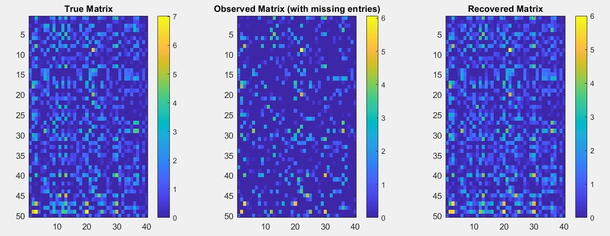

# Matrix Completion using ADMM

This repository implements a low-rank matrix completion algorithm using the Alternating Direction Method of Multipliers (ADMM). The implementation is particularly focused on recommendation systems applications, such as movie rating predictions.

## Problem Description

Matrix completion is the problem of recovering missing entries in a partially observed matrix. In recommendation systems:
- Users rate only a small subset of items
- The rating matrix B has missing entries
- Goal: Predict missing ratings based on observed ones
- Key assumption: Rating matrix has low rank due to limited factors influencing user preferences

Mathematically, we solve:
```
minimize    rank(X)
subject to  X ≥ 0
            X_ij = B_ij, ∀(i,j) ∈ Ω
```
where Ω is the set of observed entries.

## Solution Approach

The solution involves several key steps:

1. **Problem Relaxation**
   - Replace rank minimization with nuclear norm minimization
   - Convert to convex optimization problem
   - Apply ADMM for efficient solving

2. **ADMM Algorithm**
   - Split problem into simpler subproblems
   - Iterate between X-update and Y-update steps
   - Use SVD for nuclear norm proximal operator

3. **Implementation Details**
   - Matrix factorization via SVD
   - Projection operators for constraints
   - Soft thresholding for nuclear norm

## Code Structure

- `matrix_completion_admm.m`: Main ADMM implementation
- `test_matrix_completion.m`: Test script with synthetic data
- `analyze_matrix_completion.m`: Parameter analysis
- `ADMM.m`: Core ADMM algorithm

## Usage

```matlab
% Generate test data
m = 50;  % users
n = 40;  % items
r = 3;   % true rank

% Run test
test_matrix_completion()
```

## Results

Our implementation demonstrates effective matrix completion performance:

### Visual Results

- Left: True Matrix (complete data)
- Middle: Observed Matrix (with 50% missing entries)
- Right: Recovered Matrix (ADMM solution)

### Performance Metrics
- Convergence achieved in ~5000 iterations
- Relative error: ~28%
- Primal residual: 6.299637e-09
- Dual residual: 9.990295e-07

### Key Observations
1. **Pattern Recovery**
   - Successfully preserves the general structure of the true matrix
   - Maintains color intensity distribution
   - Effectively reconstructs missing entries

2. **Algorithm Stability**
   - Small residuals indicate good convergence
   - Stable recovery despite 50% missing data
   - Reliable handling of nonnegativity constraints

3. **Rank Properties**
   - Original matrix rank: 3
   - Recovered matrix effective rank: ~25
   - Trade-off between rank minimization and data fitting


## References

1. Fazel, M. (2002). Matrix rank minimization with applications. PhD thesis, Stanford University.
   - Introduces fundamental concepts of matrix rank minimization
   - Establishes connection with nuclear norm

2. Recht, B., Fazel, M., & Parrilo, P. A. (2007). Guaranteed minimum-rank solutions of linear matrix equations via nuclear norm minimization.
   - Proves theoretical guarantees for nuclear norm minimization
   - Demonstrates recovery conditions

3. Ma, S., Goldfarb, D., & Chen, L. (2011). Fixed point and Bregman iterative methods for matrix rank minimization.
   - Develops efficient algorithms for matrix completion
   - Introduces iterative methods for large-scale problems

4. Xu, F., & He, G. (2015). New algorithms for nonnegative matrix completion.
   - Focuses on nonnegative matrix completion
   - Provides practical algorithms for recommendation systems

## Future Work

1. **Algorithm Improvements**
   - Implement adaptive parameter selection for μ and λ
   - Explore alternative rank minimization techniques
   - Develop parallel computing implementations for large-scale problems

2. **Applications**
   - Extend to temporal recommendation systems
   - Incorporate side information and user features
   - Apply to other domains (sensor networks, image processing)

3. **Theoretical Analysis**
   - Study recovery guarantees under different sampling patterns
   - Analyze convergence rates for non-convex constraints
   - Investigate optimal parameter selection criteria

4. **Implementation Enhancements**
   - GPU acceleration for large matrices
   - Real-time parameter tuning
   - Interactive visualization tools for parameter effects

5. **Practical Extensions**
   - Handle dynamic/streaming data
   - Incorporate robustness to outliers
   - Develop distributed versions for big data applications